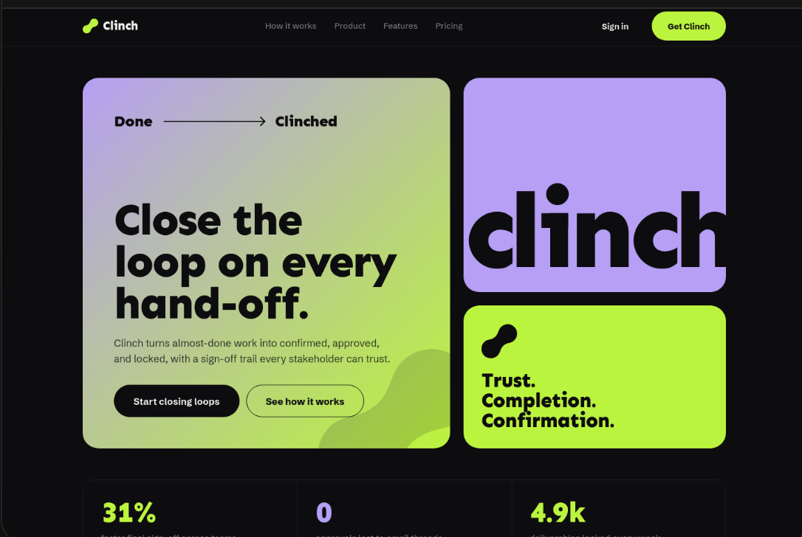
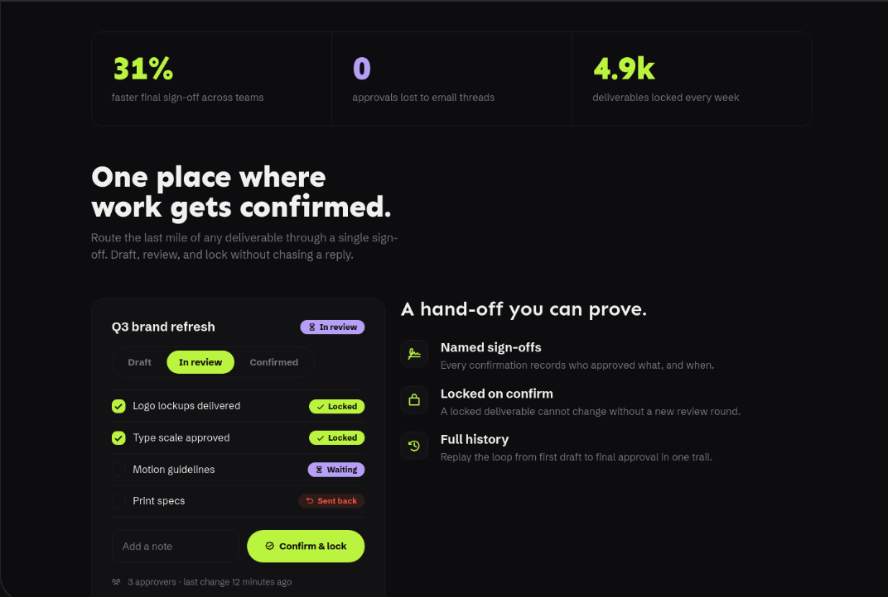
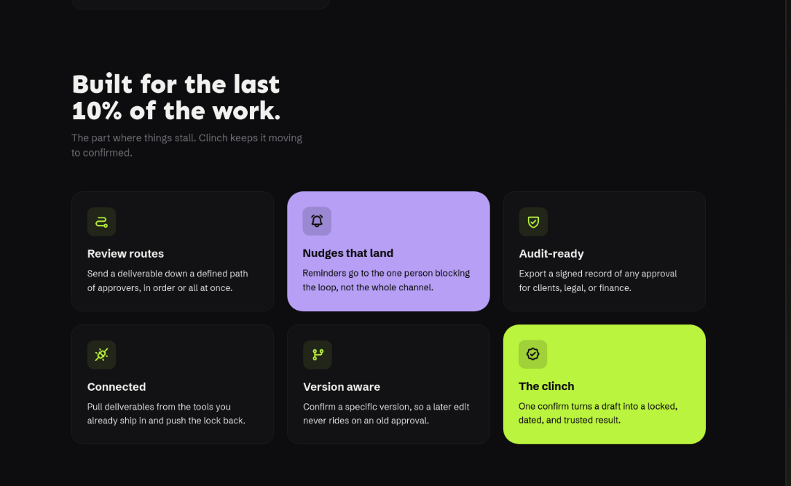

# نظام التصميم المعتمد — روافد العقارية

الحالة: معتمد حسب توجيه صاحب المشروع في 6 أكتوبر 2026. هذا الملف هو مرجع تصميم جميع صفحات البرنامج الحالية والمستقبلية.

## الاسم والهوية

- الاسم العربي الظاهر: **روافد العقارية**.
- الاسم الإنجليزي: **Rawafed Real Estate**.
- عبارة الهوية: «رؤية أوضح. قرار عقاري بثقة.»
- اسم مؤشر التحليل في المنتج: «تقييم روافد».
- يستخدم الاسم في التنقل والتذييل وعنوان المتصفح والوصف والتوثيق.
- أسماء المجلدات وحزم Java ومعرّفات قاعدة البيانات تبقى كما هي؛ تغيير الهوية لا يتطلب تغيير العقود أو المسارات التقنية.

## المرجع البصري

التصميم مستلهم من الصور الثلاث المقدمة: عنوان كبير وواضح، تكوين بطاقات متجاورة بأحجام متنوعة، زوايا دائرية، أزرار كبسولية، وحدود رفيعة. تعتمد روافد الأحمر شبه الداكن والبيج بدل الأخضر والبنفسجي في المرجع، مع صياغة عربية واتجاه RTL. حسب التوجيه الأخير أصبحت الخلفية العامة بيج فاتح؛ الصور مرجع للتكوين فقط.

الصور مرجع للتكوين والإيقاع البصري، وليست محتوى يُعرض للمستخدم أو شعارًا لروافد.

## الألوان

| الدور | اللون | متغير CSS |
|---|---|---|
| الخلفية العامة | `#EFE2C9` | `--color-bg` |
| سطح البطاقات الفاتح | `#F7EFDF` | `--color-surface` |
| السطح المرتفع | `#E6D5B9` | `--color-surface-raised` |
| حدود البطاقات | `#D6C0A8` | `--color-border` |
| الأحمر العنابي الأساسي | `#8F3038` | `--color-red` |
| الأحمر عند التفاعل | `#A53C45` | `--color-red-hover` |
| البيج الأساسي | `#EFE2C9` | `--color-beige` |
| البيج الأعمق | `#D9C3A2` | `--color-beige-deep` |
| النص الأساسي | `#281B1D` | `--color-text` |
| النص الثانوي | `#695551` | `--color-muted` |
| النص على البيج | `#281B1D` | `--color-ink` |
| النص الثانوي على البيج | `#695551` | `--color-ink-muted` |

البيج للخلفية العامة، والأسطح الفاتحة للمحتوى، والأحمر العنابي للأزرار والعناوين والإبراز. النص الأساسي داكن، والنص فوق العنابي فاتح. ألوان النجاح والخطأ وظيفية ومحدودة، وترافقها عبارة نصية.

## الخط والتكوين

- خط Tajawal، مع بديل sans-serif عند تعذر تحميله.
- أوزان 400 و500 للنصوص، 700 للعناوين الصغيرة والأزرار، 800 و900 للعناوين الرئيسية.
- عناوين رئيسية كبيرة ومتجاوبة، وفقرات قصيرة بخط واضح وتباعد أسطر 1.8.
- اتجاه RTL لجميع الصفحات، وLTR للبريد الإلكتروني عند الحاجة.
- عرض المحتوى الأقصى 1180px. الهوامش 32px على الكمبيوتر و16px على الجوال.
- شبكة مسافات أساسها 8px، مع 20–24px بين البطاقات و56–80px بين الأقسام.
- زوايا البطاقات 24px، الحقول والمكونات الصغيرة 12px، والأزرار 999px.
- أسطح مسطحة وحدود هادئة؛ لا تعتمد الهوية على التدرجات أو الظلال القوية.

## المكونات المشتركة

- العلامة: اسم روافد مع رمز هندسي معماري بخطوط بسيطة، في `Brand.jsx`.
- الأيقونات: SVG أحادية اللون من `Icon.jsx`، ولا تستبدل النصوص الدلالية.
- التنقل: شعار يمينًا، روابط الصفحات، وزر الدخول؛ قائمة قابلة للفتح والإغلاق في الجوال.
- الأزرار: عنابي فوق البيج، وفاتح فوق العنابي، وثانوي بحد واضح.
- البطاقات: فاتحة افتراضيًا، مع بطاقة بيج أو عنابية لإبراز جزء من التكوين.
- الحالات: شارات نصية للتجريبي وقيد التطوير، رسالة واضحة للفراغ أو تعذر الخدمة.
- تذييل موحد يظهر في كل صفحة ويحمل هوية روافد.

## تطبيق التصميم على الصفحات

| الصفحة | التكوين المعتمد |
|---|---|
| الرئيسية | بطاقة رئيسية بيج بعناوين كبيرة، بطاقتا هوية ووعد، شريط ركائز، معاينة توضيحية وشبكة مزايا |
| العقارات | عنوان كبير وشبكة بطاقات، السعر والموقع والمساحة، وعرض البيانات الفعلية للبيع والإيجار |
| الدخول | لوحة عنابية للهوية ونموذج بيج؛ دخول فعلي متصل بالباكند |
| لوحة التحكم | نموذج يدوي للأدمن وقائمة إعلانات قابلة للتعديل؛ المستخدم العادي لا يملك صلاحية النشر |
| تفاصيل/إنشاء/تعديل العقار | نفس الحاوية والألوان والحقول والأزرار؛ تفاصيل مقسمة إلى بطاقات، دون هوية جديدة |
| المقارنة/المفضلة/التحليل مستقبلًا | نفس قواعد التصميم، مع الإبراز بالبيج والعنابي ومعلومات فعلية بعد التنفيذ |

وجود مكوّن في التصميم لا يعني اكتمال وظيفته. تحافظ الصفحات التجريبية على توضيح حالتها، ولا تعرض تقييمًا حقيقيًا أو تحليلات أو إعلانات غير مرتبطة بالبيانات.

## الاستجابة وإمكانية الاستخدام

- تتحول الشبكات إلى عمود واحد على الشاشات الصغيرة؛ لا يوجد تمرير أفقي.
- القائمة الرئيسية للجوال تستخدم زرًا باسم واضح و`aria-expanded`.
- حد أدنى 44px لأهداف التفاعل، مع مؤشر تركيز ظاهر وروابط قابلة للاستخدام بلوحة المفاتيح.
- تسمية الحقول مرتبطة بها، والعناوين مرتبة، والأيقونات الزخرفية مخفية عن قارئ الشاشة.
- دعم `prefers-reduced-motion` وعدم الاعتماد على اللون وحده لتوصيل الحالة.
- الصفحة تحمل عنوانًا ووصفًا وfavicon بالاسم والهوية الجديدة.

## مصدر التنفيذ

الألوان والقواعد العامة: `frontend/src/index.css`.

التنقل والهوية والتذييل والأيقونات: `frontend/src/components/`.

الرئيسية: `frontend/src/pages/Home.jsx` و`Home.css`.

بقية الصفحات: `frontend/src/pages/` و`Pages.css` و`Management.css`.

نموذج الإدارة يحدد البيع أو الإيجار، والسعر الشهري أو السنوي للإيجار. لا يوجد دور بائع في تجربة المنتج.

أي تعديل على الهوية يحدّث المتغيرات والمكونات المشتركة وهذا الملف معًا. لا توضع ألوان أو أنماط محلية متعارضة داخل الصفحات.
